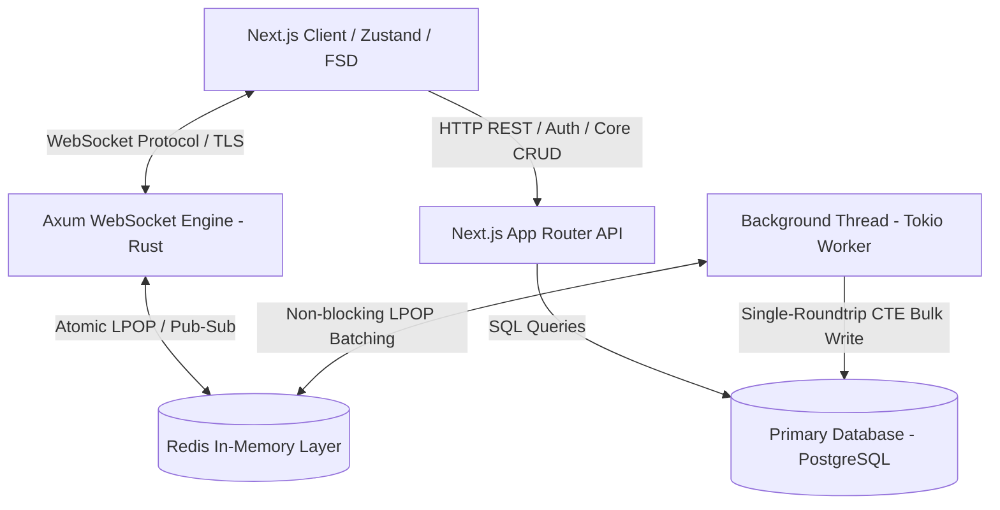
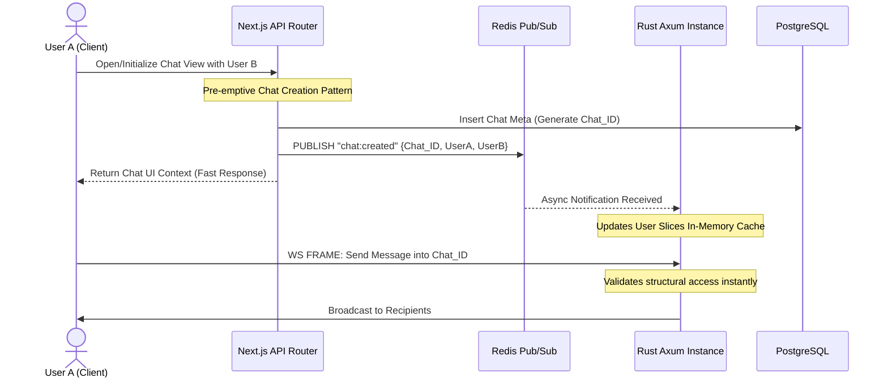

# 🏗️ System Architecture & Data Flow: chat-g

## 1. High-Level System Topology & Core Responsibilities

The system architecture is engineered as a decoupled hybrid model where the presentation layer, persistent business logic, and real-time state synchronization pools are isolated into distinct execution runtimes to achieve strict Separation of Concerns (SoC).



*   **Next.js App Router (Control & Business Plane):** Handles all heavy, non-realtime HTTP REST/RPC infrastructure. This includes User Authentication (Session management), User Registration, Core database CRUD mutations, and initial Message History hydration queries.
*   **Axum WebSockets Engine (Data & Real-Time Plane):** A highly concurrent asynchronous Rust binary dedicated exclusively to processing long-lived persistent WebSocket connections, instant message broadcasting, real-time presence propagation, and high-throughput transactional write-buffering.
*   **PostgreSQL (Persistent Storage Layer):** Acts as the single source of truth for all durable application states, housing core user identities, relational room memberships, and complete historical transaction records.

---

## 2. Stateless Core Authentication & Presigned Handshake

To prevent heavy relational database connection scaling and handshake execution stalls on the Rust engine during traffic spikes, connection authorization utilizes a stateless cryptographic handshake pattern:

1.  **Token Validation:** The client authenticates via standard HTTP endpoints handled by Next.js. Upon validation, Next.js acts as an Internal Trust Authority.
2.  **Signature Generation:** Next.js extracts user metadata (`User_ID`, `Username`, `Expiration_Timestamp`) and computes a secure **HMAC-SHA256 cryptographic signature** using a shared cluster master secret.
3.  **Connection Upgrading:** The client initializes a WebSocket connection handshake string, embedding the raw metadata and the signature into the connection query parameters.
4.  **Stateless Verification:** The Axum engine intercepts the handshake request, extracts the parameters, and re-computes the HMAC-SHA256 signature locally in memory. If the computed signature matches the parameter string and the timestamp is active, the session is instantly upgraded to a WebSocket loop with zero database round-trips.

---

## 3. High-Concurrency Memory & State Caching (Rust Layer)

To handle intense I/O concurrency without execution stalls, the Rust Axum environment leverages optimized memory primitives and an in-memory caching layer:

*   **Sharded Connection Pool (`DashMap`):** Active client WebSocket transaction channels (`Tx` sink handles) are preserved in a thread-safe `DashMap` cluster indexed by `User_ID`. `DashMap` splits the underlying hash table into autonomous internal storage shards. This completely avoids global mutex locking bottlenecks across CPU threads, allowing concurrent mutations on separate shards without thread starvation.
*   **Global Presence Registry (`Redis Set`):** Upon establishing a connection, the Rust thread instantly updates a global Redis set (`users:online`) with the active user identifier. The Next.js discovery routes scan this light cache array for low-latency queries during user search indexing, completely eliminating slow text-pattern parsing on the persistent PostgreSQL layer.
*   **Session Termination Cleanup:** When a connection drops, the socket loop handles teardown atomically by evicting the reference from the local `DashMap` sharded table and syncing state back to the `users:online` Redis collection.

---

## 4. Distributed Event Synchronization & Race-Condition Evasion

The messaging layer handles data consistency boundaries between the relational persistent tier (Next.js + PostgreSQL) and the transient layer (Rust + Redis) via an event-driven synchronization bus:



*   **The First-Message Race Condition:** In early development, initiating a chat and immediately firing a message caused a race condition: the Rust state worker could not verify room ownership before the message frame landed, because PostgreSQL indexing lagged behind the WebSocket I/O loop.
*   **Pre-emptive State Invalidation Architecture:** To resolve this, the topology implements a pre-emptive cache invalidation strategy. The moment a user selects a contact profile, the chat row metadata is immediately generated via an optimized Next.js route. Simultaneously, an event is emitted into **Redis Pub/Sub**. 
*   **Real-Time State Upgrades:** An autonomous background thread within the Axum service subscribes to this message bus. It intercepts the `chat:created` frame and immediately re-hydrates the allowed chat cache matrix for both target users. This completely eliminates race conditions during immediate messaging workflows.

---

## 5. High-Throughput Batch-Writing Engine (The Rust Worker)

To mitigate heavy I/O compute amplification on the PostgreSQL instance during messaging spikes, the backend completely avoids traditional single-row persistent writes. Instead, an autonomous, long-running background worker manages state ingestion via non-blocking micro-batching streams.

### Micro-Batching Mechanics
1.  **Non-Blocking Bulk Extraction:** The database worker runs an execution loop using `tokio::time::interval`. It queries the `queue:messages` list using the non-blocking **`LPOP` command with a threshold limit of 200 items**. If the queue is dry, the thread gracefully falls back to a 1-second timeout loop to prevent CPU spin-locks.
2.  **Dynamic Backoff Shifting:** If records are actively processed, the worker throttles at a dense `500ms` compute interval. If the queue is depleted, it auto-shifts into a relaxed `1000ms` standby loop.

### Single-Roundtrip Multi-Mutation SQL Pipeline
Rather than splitting analytical synchronization across multiple database statements, the processed message vector is compiled into a single, massive **PostgreSQL Common Table Expression (CTE)** query execution block:

```sql
WITH inserted_messages AS (
    INSERT INTO "Message" (content, "conversationId", "senderId", "createdAt", "isRead", type)
    VALUES ($1, $2, $3, $4, $5, $6::"MessageType"), (...)
    RETURNING content, "conversationId", "senderId", "createdAt", "isRead", type
),
latest_messages AS (
    SELECT DISTINCT ON ("conversationId") * FROM inserted_messages
    ORDER BY "conversationId", "createdAt" DESC
)
UPDATE "ConversationParticipant" AS cp
SET
    "lastMessageContent" = latest_messages.content,
    "lastMessageTime" = latest_messages."createdAt",
    "lastMessageSenderId" = latest_messages."senderId",
    "lastMessageIsRead" = latest_messages."isRead",
    "lastMessageType" = latest_messages.type
FROM latest_messages
WHERE cp."conversationId" = latest_messages."conversationId"
```

### Architectural Trade-offs & Fault Tolerance Boundary
*   **Throughput Optimization over Strict Delivery:** The pipeline prioritizes ultra-high message ingestion speeds. By utilizing atomic `LPOP` queues, records are popped into the worker's execution memory plane before PostgreSQL execution confirmation.
*   **Resilience Profile:** While this introduces a calculated risk of up to 200 payload drop events during catastrophic OS kernel failures or infrastructure hardware crashes, it effectively eliminates standard live database execution locking. For strict **At-Least-Once** guarantees, this boundary can be scaled up to use `RPOPLPUSH` secondary buffer state tables or native Redis Streams architectures, synced with Redis Write-Ahead Logging (`AOF`).

---

## 6. High-Efficiency Media & Audio Framework

*   **Audio Compacting:** Audio feeds are captured natively via the client browser's `MediaRecorder API`, compressed via the lightweight **Opus codec**, and transmitted inside a `.webm/.ogg` wrapper to cut payload size by up to 70%.
*   **Local Disk Allocation:** File uploads hit a dedicated HTTP POST endpoint that streams data directly onto the server's local storage array, utilizing a controlled **20 GB quota** for near-zero infrastructure overhead during MVP launch.
*   **Database Mapping:** The local file-path string is tracked inside the persistent database under the target message row metadata, eliminating heavy binary object processing in the database kernel.

---

## 7. MVP Constraints & Infrastructure Scope

*   **Deployment Pipeline:** Next.js Responsive Web Engine configured as a Fully **PWA-ready** platform for instant, mobile-native execution, completely bypassing App Store app-review and distribution delays.
*   **Hardware Monolith:** The entire stack (Next.js server, compiled native Rust binary, isolated Redis cluster node, database engine) is provisioned to execute securely inside a single, scalable, cost-effective Linux VPS instance.

---

## 8. Frontend Layer: Feature-Sliced Design (FSD)

The client engine is structured strictly under the **Feature-Sliced Design** architectural methodology to enforce high cohesion and loose coupling across components:

*   **App:** Global configurations, providers, routing wrappers, and entry-point styles.
*   **Widgets:** Monolithic UI assemblies combined from multiple features or entities (e.g., `widgets/sidebar/ui/saved-chats/SavedChat.tsx`).
*   **Features:** Discretized, user-driven actions and transactional business logic (e.g., active messaging queues, status toggles).
*   **Entities:** Domain models and business concepts representing business data structures (e.g., User, Chat, Message slices).
*   **Shared:** Reusable, application-agnostic UI components, low-level network utilities, and globally shared helpers.
*   **State Management:** State isolation is handled via **Zustand**, maintaining separate independent slices for transient UI states and cache synchronization loops with the backend.
